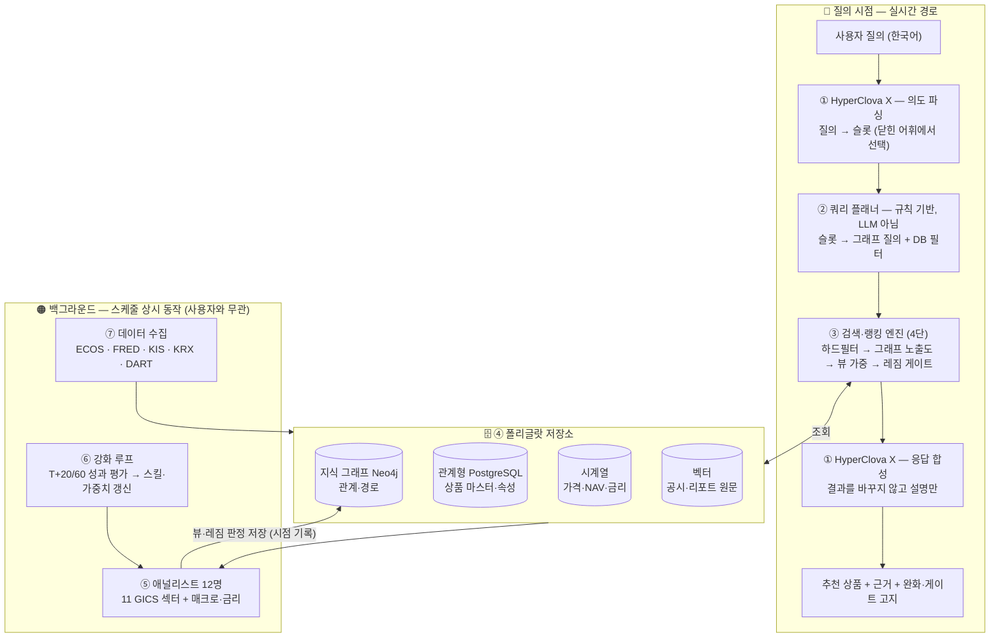
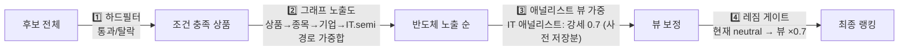
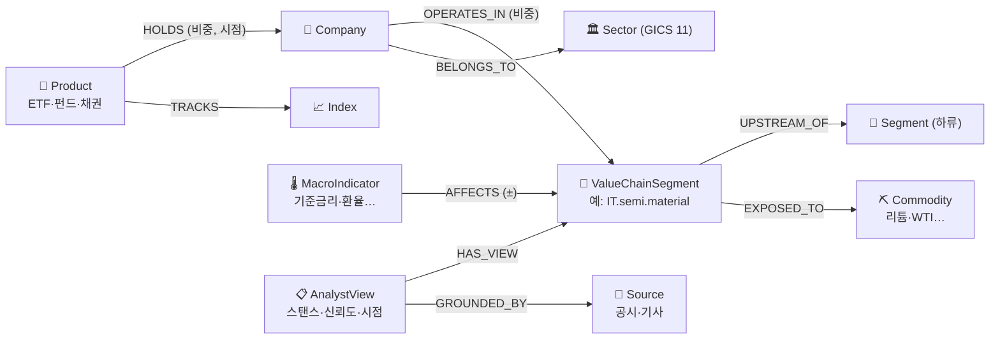
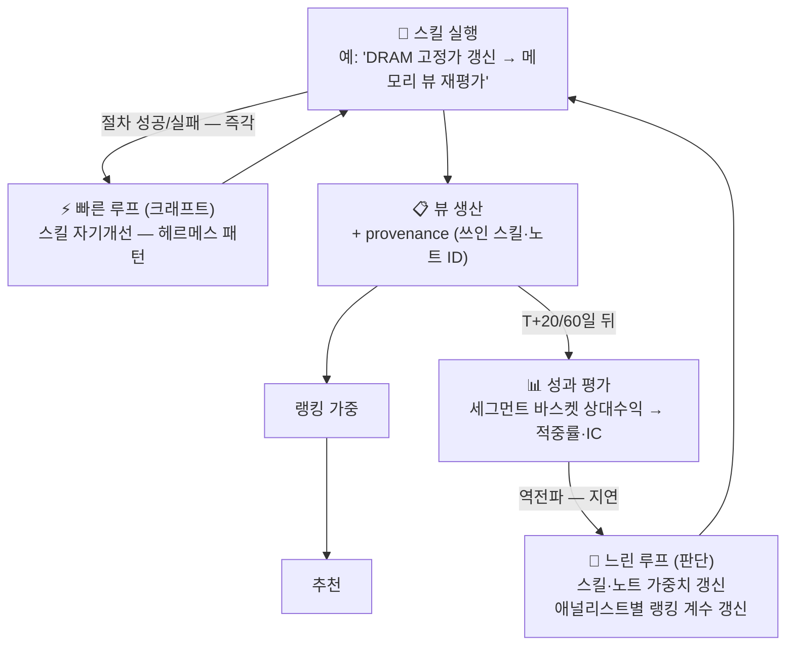

# 00. 시스템 개요 — 전체 아키텍처와 동작 방식

> 이 문서는 01~07 설계 문서 전체를 관통하는 지도다. 상세는 각 문서로, 큰 그림은 여기서.

## 1. 이 시스템은 무엇인가

**한국어 자연어 질의를 받아, 실존하는 국내 상장 금융상품(ETF·펀드·채권)을 검색·랭킹해 근거와 함께 추천하는 시스템.**

- 포트폴리오 비중 최적화기가 **아니다** — "무엇을 얼마나 살지"가 아니라 "조건에 맞는 상품이 무엇인지"에 답한다.
- LLM 챗봇이 **아니다** — LLM은 입구(의도 파싱)와 출구(설명)에만 있고, 상품을 고르는 건 데이터와 규칙이다.

한 문장 골격:

> HyperClova X가 한국어 질의를 구조화된 의도로 바꾸고 → 쿼리 플래너가 그 의도를 결정적 쿼리로 번역하고 → 지식 그래프 + 상품 DB에서 후보를 검색·랭킹하되, 12명 애널리스트의 사전 계산된 뷰와 유동성 레짐이 랭킹을 보정하며 → 강화 루프가 애널리스트를 성과 신호로 개선하고 → HyperClova X가 결과를 한국어로 설명한다.

## 2. 4대 불변 원칙

모든 설계 결정이 이 넷에서 나온다:

| # | 원칙 | 이유 |
|---|---|---|
| 1 | **LLM은 상품을 직접 고르지 않는다** | 환각(없는 상품 추천) 원천 차단. LLM은 닫힌 어휘에서 고르는 번역기 |
| 2 | **근거 없는 관계는 그래프에 넣지 않는다** | 환각 엣지 하나가 그래프 전체를 오염시킨다. 출처·신뢰도·검증 게이트 필수 |
| 3 | **모든 데이터는 point-in-time** | 엣지·뷰·레짐 판정에 시점을 각인해야 "그때의 상태"를 복원하고 사후 채점이 가능하다 |
| 4 | **측정 없는 강화는 없다** | 적중률을 재지 않으면 에이전트는 "정확한" 쪽이 아니라 "그럴듯한" 쪽으로 드리프트한다 |

## 3. 전체 구조 — 두 개의 시간대

이 시스템을 이해하는 열쇠는 **"질의 시점"과 "백그라운드"가 분리**돼 있다는 것이다. 애널리스트는 질문이 올 때 호출되는 게 아니라, 평소에 뷰를 만들어 그래프에 저장해 둔다. 질의 시점에는 이미 만들어진 것을 꺼내 쓸 뿐이다.



## 4. 질의 하나의 여정 (구체 예시)

> **"안정적으로 배당 받으면서 반도체 업황 회복에도 올라탈 수 있는 상품 있어?"**

**1단계 — 의도 파싱 (HyperClova X)** · [06 §4](06-query-planner.md)

```yaml
purpose: 인컴          # "배당 받으면서"
risk_level: 안정형      # "안정적으로"
views: [{target: IT.semi, direction: 강세}]   # "반도체 회복" → 그래프 실재 노드 ID로
product_types: [ETF, 펀드]
```
LLM은 여기서 **정해진 메뉴판에서 고르기만** 한다. `IT.semi`는 그래프에 실재하는 세그먼트 ID다 — 지어낸 이름이 아니라.

**2단계 — 쿼리 플래너 (코드, LLM 아님)** · [06 §2](06-query-planner.md)

정책 테이블을 조회해 슬롯을 실행 쿼리로 번역:
- `안정형` → 변동성 하위 50%, AUM 300억↑ (soft) / 레버리지·인버스 제외 (hard)
- `인컴` → 분배금 있음 + 랭킹에서 배당수익률 가중 ↑
- `IT.semi 강세` → 그래프 탐색 시작 노드

**3단계 — 검색·랭킹 (4단)** · [01 §3-③](01-architecture.md)



결과 수가 3개 미만이면 **제약 완화 루프**가 soft 필터를 정해진 우선순위로 한 단계씩 풀고, 푼 내역을 기록한다.

**4단계 — 응답 합성 (HyperClova X)**

랭킹 결과 + 점수 분해 내역(explanation trace)을 받아 한국어로 설명한다. 완화가 있었으면 반드시 고지: *"조건을 모두 만족하는 상품이 적어 변동성 기준을 완화했습니다."* 결과를 바꾸는 권한은 없다.

## 5. 지식 그래프 — 시스템의 연결 조직

상품→구성종목→기업→밸류체인→원자재→매크로를 관통하는 다중 홉 경로가 검색과 근거 설명의 재료다. · [03](03-graph-schema.md)



**3계층 신뢰 정책**이 핵심이다:

| 계층 | 내용 | 갱신 | 신뢰 |
|---|---|---|---|
| L0 정적 온톨로지 | GICS·밸류체인 DAG·섹터 간 인과 지도 | 사람이 하드코딩 | 무조건 |
| L1 준정적 마스터 | 상품·기업·구성종목 | 배치 파이프라인 | 소스=사실 |
| L2 동적 관계 | 공급 관계·테마·애널리스트 뷰 | 에이전트 제안 | **출처 필수 + 검증 게이트 통과분만** |

양방향 탐색이 가능하다: "이 ETF는 뭐에 노출?"(정방향)과 "리튬 리스크 피하려면 뭘 피해야?"(역방향) 모두 같은 그래프의 경로 질의다. 엣지는 삭제하지 않고 `valid_to`로 마감해 과거 상태를 복원할 수 있다.

## 6. 애널리스트 12명 — 두 축으로 성장하는 백그라운드 생산자

GICS 11개 섹터 + 매크로·금리 1명. 각자 담당 밸류체인(총 40여 개 세그먼트)과 모니터링 지표를 갖는다. · [02](02-sector-analysts.md)

실력을 **두 축으로 분리**하고 각각 다른 루프를 붙인 게 학습 설계의 핵심이다. · [05](05-analyst-structure.md)



- **빠른 루프(크래프트)**: "데이터를 제대로 뽑았나" — 헤르메스 패턴(경험 기반 스킬 생성·자기개선·메모리 큐레이션)이 담당. 즉각 피드백.
- **느린 루프(판단)**: "결론이 맞았나" — 우리가 짓는 평가 파이프라인. 모든 뷰에 provenance(스킬·노트 ID)를 기록해 두었다가, 몇 주 뒤 성과를 그 스킬·노트로 역전파한다.
- 헤르메스는 크래프트만 준다. **판단 신호를 먹이지 않으면 에이전트는 "맞는" 쪽이 아니라 "매끄러운" 쪽으로 드리프트한다** — 두 루프의 연결이 강화의 전부다.

## 7. 유동성 레짐 — 방향과 선택의 2층 구조

가격의 단기 방향은 자금·심리(유동성)가, 그 안의 상대 우열은 펀더멘털이 정한다. 섹터 애널리스트가 "선택(알파)"을, 레짐 레이어가 "방향(베타)"을 맡아 곱해진다. · [07](07-liquidity-regime.md)

```
유동성 4개 층 (섞으면 노이즈 — 반드시 분리 측정)
 L1 매크로 순유동성   Fed B/S − RRP − TGA, M2          (월~분기)
 L2 금융환경          신용스프레드·VIX·달러              (주)
 L3 자금 흐름         ETF 플로우·외국인 수급 ★한국의 엣지  (일~주)
 L4 미시 유동성       거래대금·호가                      (일중)
        ↓ z-score 합성 (규칙 기반, LLM 아님)
 레짐 판정: {완화|중립|긴축} × {risk-on|neutral|risk-off}
        ↓
 랭킹 게이트: risk-off → 강세 뷰 표현 ×0.4 + 방어 틸트
```

원칙 두 개: **측정(nowcasting)만 하고 예측(forecasting)은 하지 않는다**, 게이트는 **비대칭**(위험을 늘리는 방향만 축소, 사용자가 명시하면 막지 않고 고지만).

## 8. LLM이 있는 곳, 없는 곳 — 환각 차단 지도

| 단계 | 담당 | LLM? | 환각 방어 |
|---|---|---|---|
| 의도 파싱 | HyperClova X | ✅ | 닫힌 어휘(슬롯 메뉴판)에서만 선택 |
| 어휘 밖 표현 보정 | 벡터 검색 + LLM | ✅ 제한적 | 실재 노드 후보 중 택1만, 유사도 낮으면 되묻기 |
| 쿼리 변환 | 정책 테이블 + 코드 | ❌ | — |
| 검색·랭킹·완화 | 그래프 질의 + 규칙 | ❌ | — |
| 레짐 분류 | z-score 규칙 | ❌ | — |
| 그래프 L2 엣지 생성 | 애널리스트 에이전트 | ✅ | 출처 필수 + 독립 검증 게이트 + 신뢰도 하한 |
| 응답 합성 | HyperClova X | ✅ | 결과 변경 불가, 설명만. 완화·게이트 반드시 고지 |

LLM은 **항상 선택지가 좁혀진 채로** 등장하고, 자유 서술이 실행 쿼리나 그래프 사실로 직행하는 경로는 없다.

## 9. 데이터 — 무엇을 어디서

| 소스 | 상태 | 채우는 것 |
|---|---|---|
| KIS OpenAPI | ✓ 보유 | ETF 마스터·구성종목(그래프의 심장), 시세·NAV, 투자자별 매매동향 |
| ECOS | ✓ 보유 | 국내 매크로 전부 (금리 커브·환율·CPI·M2·가계신용) |
| FRED | ✓ 보유 | 글로벌 매크로 + 미국 순유동성(WALCL·RRP·TGA) |
| 토스증권 | ✓ 보유 | 보조 시세 (제공 범위 확인 필요) |
| DART | 무료 발급 | 공시 — L2 엣지 grounding의 핵심 |
| KRX·금투협·SEIBro | 무료 | ETF 목록 교차검증, 채권 시가평가·등급, 펀드 마스터 |

원칙: 원본(raw) 보존, 수집 시점과 데이터 기준일 분리 각인, 급변·결측 시 적재 보류. · [04](04-data-pipeline.md)

## 10. 구현 로드맵 — 3 Phase

| | Phase 1 | Phase 2 | Phase 3 |
|---|---|---|---|
| **목표** | 애널리스트 없이도 유용한 검색기 | 뷰가 랭킹을 보정 | 시스템이 스스로 나아짐 |
| **범위** | ETF 마스터·구성종목 수집, 그래프 L0+L1, 의도 파싱, 하드필터+노출도 랭킹, 완화 루프 | 애널리스트 가동(IT·금융·매크로 먼저), 뷰 가중, 빠른 루프, 레짐 분류(게이트는 로그만) | 느린 루프(적중 평가→역전파), 레짐 게이트 실적용, 캘리브레이션 대시보드 |
| **성공 기준** | "반도체 소재 ETF 찾아줘"에 실존 상품만 근거 경로와 함께 | 뷰 반영 전/후 랭킹 차이 설명 가능, 모든 뷰 로그 | 애널리스트별 적중률 대시보드, 저성과 스킬 자동 개정 이력 |

**콜드스타트 순서**: 그래프에 데이터가 차야 애널리스트가 일할 수 있고, 뷰가 쌓여야 평가가 가능하고, 평가가 쌓여야 강화가 돈다. Phase 1이 애널리스트 없이 성립해야 하는 이유다.

## 11. 문서 지도

| 문서 | 내용 | 이 개요에서의 위치 |
|---|---|---|
| [01-architecture.md](01-architecture.md) | 컴포넌트 7개, 슬롯 스키마, Phase 정의 | §3, §10 |
| [02-sector-analysts.md](02-sector-analysts.md) | 12명 담당 범위, 40+ 밸류체인, 지표, 인과 지도 | §6 |
| [03-graph-schema.md](03-graph-schema.md) | 노드·엣지 타입, 3계층, 검증 게이트, 질의 패턴 | §5 |
| [04-data-pipeline.md](04-data-pipeline.md) | 데이터 13종 × 소스 매핑, 수집 스케줄 | §9 |
| [05-analyst-structure.md](05-analyst-structure.md) | 두 축 학습 루프, 보상·귀속·가중치 변환 | §6 |
| [06-query-planner.md](06-query-planner.md) | 정책 테이블, 제약 완화, LLM fallback 경계 | §4, §8 |
| [07-liquidity-regime.md](07-liquidity-regime.md) | 유동성 4층, 레짐 분류, 랭킹 게이트 | §7 |
| [08-intent-parsing.md](08-intent-parsing.md) | 의도 파싱: N-best 해석·검증·해석 메뉴·골든셋 루프 | §4-1단계, §8 |
